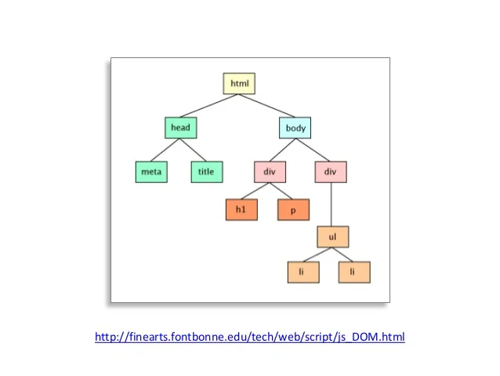

## 과제 체크포인트

### 기본과제

#### 1) 라우팅 구현:
- [ O ] History API를 사용하여 SPA 라우터 구현
  - [ O ] '/' (홈 페이지)
  - [ O ] '/login' (로그인 페이지)
  - [ O ] '/profile' (프로필 페이지)
- [ O ] 각 라우트에 해당하는 컴포넌트 렌더링 함수 작성
- [ O ] 네비게이션 이벤트 처리 (링크 클릭 시 페이지 전환)
- [ O ] 주소가 변경되어도 새로고침이 발생하지 않아야 한다.

#### 2) 사용자 관리 기능:
- [ O ] LocalStorage를 사용한 간단한 사용자 데이터 관리
  - [ O ] 사용자 정보 저장 (이름, 간단한 소개)
  - [ O ] 로그인 상태 관리 (로그인/로그아웃 토글)
- [ O ] 로그인 폼 구현
  - [ O ] 사용자 이름 입력 및 검증
  - [ O ] 로그인 버튼 클릭 시 LocalStorage에 사용자 정보 저장
- [ O ] 로그아웃 기능 구현
  - [ O ] 로그아웃 버튼 클릭 시 LocalStorage에서 사용자 정보 제거

#### 3) 프로필 페이지 구현:
- [ O ] 현재 로그인한 사용자의 정보 표시
  - [ O ] 사용자 이름
  - [  O ] 간단한 소개
- [ O ] 프로필 수정 기능
  - [ O ] 사용자 소개 텍스트 수정 가능
  - [ O ] 수정된 정보 LocalStorage에 저장

#### 4) 컴포넌트 기반 구조 설계:
- [ O ] 재사용 가능한 컴포넌트 작성
  - [ O ] Header 컴포넌트
  - [ O ] Footer 컴포넌트
- [ O ] 페이지별 컴포넌트 작성
  - [ O ] HomePage 컴포넌트
  - [ O ] ProfilePage 컴포넌트
  - [ O ] NotFoundPage 컴포넌트

#### 5) 상태 관리 초기 구현:
- [ O ] 간단한 상태 관리 시스템 설계
  - [ O ] 전역 상태 객체 생성 (예: 현재 로그인한 사용자 정보)
- [ O ] 상태 변경 함수 구현
  - [ O ] 상태 업데이트 시 관련 컴포넌트 리렌더링

#### 6) 이벤트 처리 및 DOM 조작:
- [ O ] 사용자 입력 처리 (로그인 폼, 프로필 수정 등)
- [ O  ] 동적 컨텐츠 렌더링 (사용자 정보 표시, 페이지 전환 등)

#### 7) 라우팅 예외 처리:
- [ O ] 잘못된 라우트 접근 시 404 페이지 표시

### 심화과제

#### 1) 해시 라우터 구현
- [ ] location.hash를 이용하여 SPA 라우터 구현
  - [ ] '/#/' (홈 페이지)
  - [ ] '/#/login' (로그인 페이지) 
  - [ ] '/#/profile' (프로필 페이지)
 
#### 2) 라우트 가드 구현
- [ ] 로그인 상태에 따른 접근 제어
- [ ] 비로그인 사용자의 특정 페이지 접근 시 로그인 페이지로 리다이렉션

#### 3) 이벤트 위임

- [ ] 이벤트 위임 방식으로 이벤트를 관리하고 있다.

## 과제 셀프회고

<!-- 과제에 대한 회고를 작성해주세요 -->

1. 첫 문제 : 히스토리 API 로 페이지 랜더링을 실시한다
path 별로 반응하는 addRoute 이벤트에 모듈화한 페이지를 할당 한다
그런데 첫 페이지 랜더링 하는 상황에 문제가 발생했다

여러 해결 방법을 탐색 중이다..

콘솔을 찍어보니 navigateTo 와 handlePopState 부터 콘솔이 찍히지 않는다 왜일까?
두 함수가 선언되는 시점을 살펴보니,

navigateTo 함수는 수동으로 혹은 이벤트를 통한 능동적으로 path가 수정되었을 경우에 호출되고
handlePopState 함수는 popState 가 호출하는 흐름인데 즉 뒤로가기 앞으로 가기 때에 호출 되는 함수라고 볼 수 있다다

결론 : 채택한 해결방안은, router.addRoute 에 각 path 를 추가한 후에 router.navigationTo 로 window.location.pathname 를 넘겨주는 방식이다

2. 두 문제 : 각 탭을 눌러서 이벤트를 호출했을 경우에 이미 클릭 된 이벤트가 다시 호출 될 필요는 없다고 생각하여

```javascript
if (e.target.pathname !== window.location.pathname) router.navigateTo(e.target.pathname);
```

로 errorExcept 해주었다

---
### 기술적 성장
- DOM과 BOM : 이벤트 위임을 이해하기 전에 DOM과 BOM에 대한 개념이 먼저 필요했다.
자료를 더 찾아보니, 브라우저의 최상위 객체는 **BOM(브라우저 객체 모델)** 의 window 객체라는 것을 알게 되었다.
그리고 이 window 객체 하위에는 **DOM(문서 객체 모델)** 이 존재한다.

- BOM은 브라우저와 관련된 기능(window, navigator, location, history 등)을 제어하는 객체 모델이다.
**최상위 객체는 window** 이며 브라우저 자체의 기능을 다룰 수 있다.

- DOM은 HTML 문서를 객체화한 구조로, 브라우저가 HTML 문서를 트리 구조로 표현한 것이다.
DOM은 window 객체의 하위인 document 객체를 통해 접근할 수 있다.
이 document 객체를 기준으로 HTML 요소들이 노드로 연결된 DOM Tree가 형성된다.

- 즉, BOM은 브라우저 환경을 제어하는 모델이고, DOM은 HTML 문서의 구조를 제어하는 모델이다.
DOM Tree 구조를 이해하면서 노드 간의 관계와 이벤트 위임의 작동 방식을 파악하는 데 큰 도움이 될 것 같다.(아직 안함)

- 선언한 코드도 사실 tree 구조 중, 뿌리(root)에서 시작해서 잎(leaf)에서 끝난다 할때 뿌리에 해당된다
```javascript
  // DOM 의 뿌리 부분, 즉 DOM 노드
  document.getElementById("root").innerHTML = content; 
  //선언이 되며 "#root" 요소 내부의 모든 내용이 새로운 값으로 대체 됨
```



[그림] https://m.blog.naver.com/magnking/220972680805
<br />

- 이벤트 위임 : 버블링과 캡처링

<br />

- History API : 업무를 하면서 **리액트 라우터** 의 원초적 개념을 모른체 사용하고 있었다는 것을 알게 되었다.<br/>**리액트 라우터** 가 실은 내부적으로 History API 를 사용한다는 것을 배우는 순간 이었다. (뜨든!)

### 코드 품질
- 코드가 겹치는 부분이 많았다 <br />
예시로, History API 를 구현에 있어서 router.addRoute() 파트는 path 별로 아래 코드를 모두 할당해 주었어야 했다
```javascript
document.getElementById("root").innerHTML = content; 
```
하지만, 하나의 함수로 정의해주면 파라미터 값에 따라 이벤트 처리도 각각 동시에 해줄 수 있다고 생각했다<br />
따라서 **loadRoute(content)** 라는 함수를 정의하여 파라미터로 컴포넌트화 된 각 페이지 정보를 넘겨주었다
```javascript
// 파라미터로 페이지 컴포넌트 받아 옴
function loadRoute(content) {
  document.getElementById("root").innerHTML = content;

  switch (content) {
    case FirstPage():
      // FIrstPage 에 해당하는 이벤트 처리
      break;
    case SecondPage():
      // SecondPage 에 해당하는 이벤트 처리
      break;
      // 등..
    default:
      break;
  }
}
```

**TME.** loadRoute() 에 문제가 있었다.<br />
기본 과제가 끝나서 커밋을 하려는데 ESLint 테스트에 걸렸다.<br />
살펴보니 switch case 문에 오류가 있었다.<br />
기능적인 오류는 아니었고 조건문의 흐름에 방해가 되는 부분이었다.<br />
  1. switch case 문에 여러개의 변수가 선언되어서는 안된다.
    - 필요하다면 **'{ }'** 를 사용해서 구현하면된다고 한다.
  2. case 뒤에는 상수나 표현식이 와야 한다.
    - 난 **FirstPage()** 와 같이 함수 호출을 했기 때문에 안된 것이다.<br /><br />
  ***해결 :* 그냥 간단하게 if 문으로 갈아탔다.** ~~끄읕~~


### 학습 효과 분석
<!-- 예시
- 가장 큰 배움이 있었던 부분
- 추가 학습이 필요한 영역
- 실무 적용 가능성
-->

### 과제 피드백
<!-- 예시
- 과제에서 모호하거나 애매했던 부분
- 과제에서 좋았던 부분
-->

## 리뷰 받고 싶은 내용
- 이벤트 리스너는 항상 DOM 랜더링 이후에 선언을 해두어야 에러가 발생하지 않는 것을 경험했습니다.<br />해당 요소를 찾지 못해서 그렇다고 생각합니다. 그래서 랜더링 되는 페이지 별로 리스너를 처리하는 함수 **loadRoute(content)** 를 선언 해두었는데요.<br />비동기적으로 렌더링되는 요소에 대해 DOM을 주기적으로 체크하는 방식 대신, 효율적으로 이벤트를 바인딩하는 방법을 알고 싶습니다.<br />
<!--
피드백 받고 싶은 내용을 구체적으로 남겨주세요
모호한 요청은 피드백을 남기기 어렵습니다.

참고링크: https://chatgpt.com/share/675b6129-515c-8001-ba72-39d0fa4c7b62

모호한 질문의 예시)
- 무엇을 질문해야 할지 몰라서 코치님이 보시기에 고쳐야할것들 전반적으로 피드백 부탁드립니다.
- 코드 스타일에 대한 피드백 부탁드립니다.
- 코드 구조에 대한 피드백 부탁드립니다.
- 개념적인 오류에 대한 피드백 부탁드립니다.
- 추가 구현이 필요한 부분에 대한 피드백 부탁드립니다.

구체적인 질문의 예시)
- 파일A의 함수B와 그 안의 변수명을 보면 직관성이 떨어지는 것 같습니다. 함수와 변수 이름을 더 명확하게 지을 방법에 대해 조언해 주실 수 있나요?
- 현재 파일 단위로 코드를 분리했지만, 이번 주차 발제를 기준으로 봤을 때 모듈화나 계층화에서 부족함이 있는 것 같습니다. 특히 A와 B 부분에서 모듈화를 더 진행할지 그대로 둘지 고민하였습니다. (...구체적인 고민 사항 적기...). 코치님의 의견이 궁금합니다.
- 옵저버 패턴을 사용해 상태 관리 로직을 구현해 보려 했습니다. 제가 구현한 코드가 옵저버 패턴에 맞게 잘 구성되었는지 검토해 주시고, 보완할 부분을 제안해 주실 수 있을까요?
- 컴포넌트 A를 테스트 할 때 B와의 의존성 때문에 테스트 코드를 작성하려다 포기했습니다. A와 B의 의존성을 낮추고 테스트 가능성을 높이는 구조 개선 방안이 있을까요?
-->
